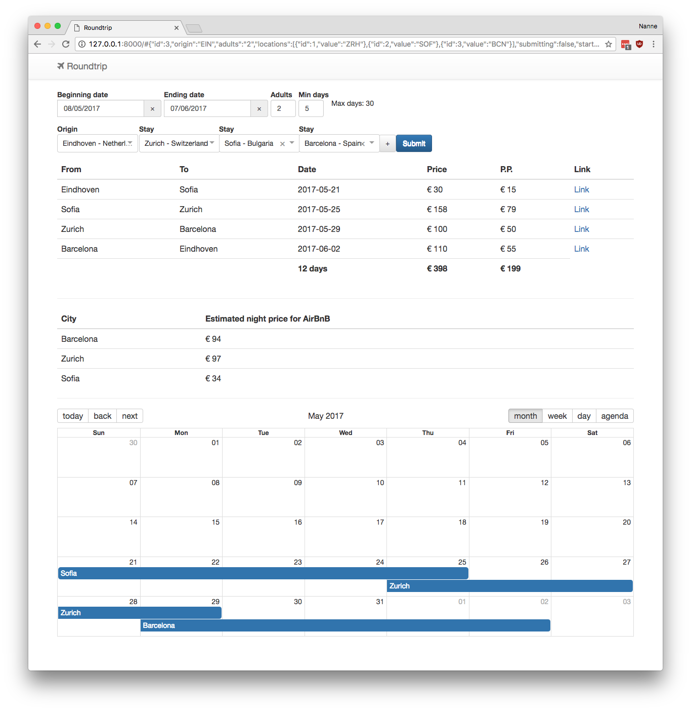

# New: Tripchemy
After using the below project, me and @Roconda started developing a version that scrapes from airlines directly and uses smart algorithms to directly provide routes. Check out https://nerd.tripchemy.com/ for an alpha version.


# Roundtrip finder
*Warning:* This project finds flight information from Google Flights and room price information from AirBNB, do not abuse their services.

This code is in no way affiliated with, authorized, maintained, sponsored or endorsed by Google or AirBnB or any of their affiliates or subsidiaries. This crawls the data from Google Flights and AirBnB. Use at your own risk.

The roundtrip finder searches for the cheapest tour within given locations.

## Functionality


## Install
First optionally create a python enviroment.

Then execute the following commands:
```
pip3 install -r requirements.txt
python3 manage.py runserver
```

You might need to install the chromedriver, on an OSX machine you can run:
```
brew install chromedriver
```
## Catches
There are some catches which I address below:

- consider the flight times, you want to avoid flying too early or too late as you have to travel to the airport. Currently, flights are filtered with a departure time between 08:00 and 20:00. This is hard-coded and you can find the query parameter [here](https://github.com/Whazor/Roundtrip/blob/master/planner/search.py#L64).
- it only searches for continental destinations, currently fixed to Europe which is hard-coded [here](https://github.com/Whazor/Roundtrip/blob/master/assets/js/Airports.js#L11). I tried adding intercontinential but got negative results.
- consider the distance from airport to city (airport of paris is 2 hours traveling)
- flights can be canceled, have a backup plan (for example a rental car). In Europe you retrieve compensation for last-minute changes, [more details](http://europa.eu/youreurope/citizens/travel/passenger-rights/air/index_en.htm).

Safe travels! Let everyone know about your (un)successful trips in the issues.

## Feedback
When running into problems, please create issues or pull requests.
